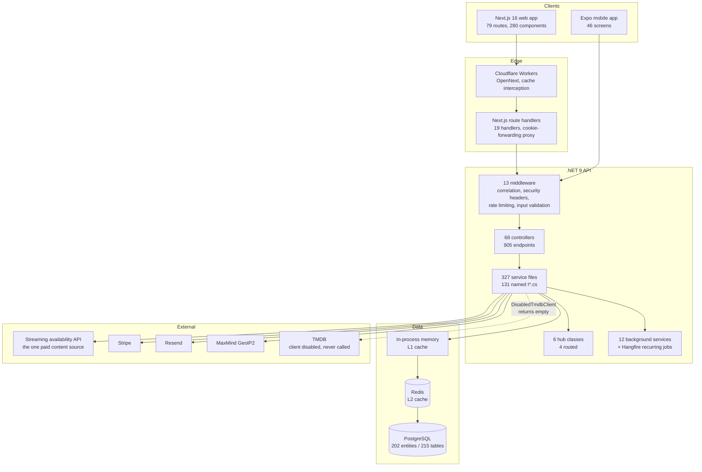
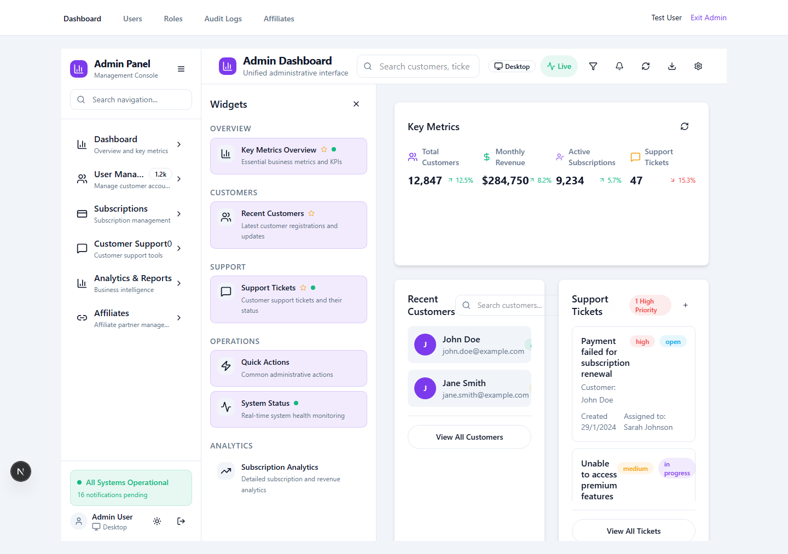
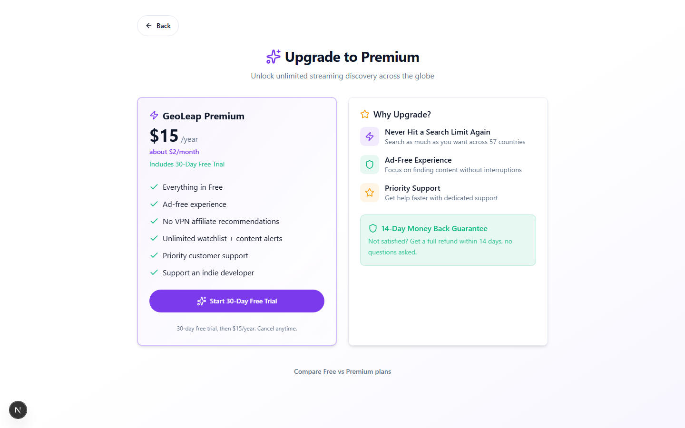
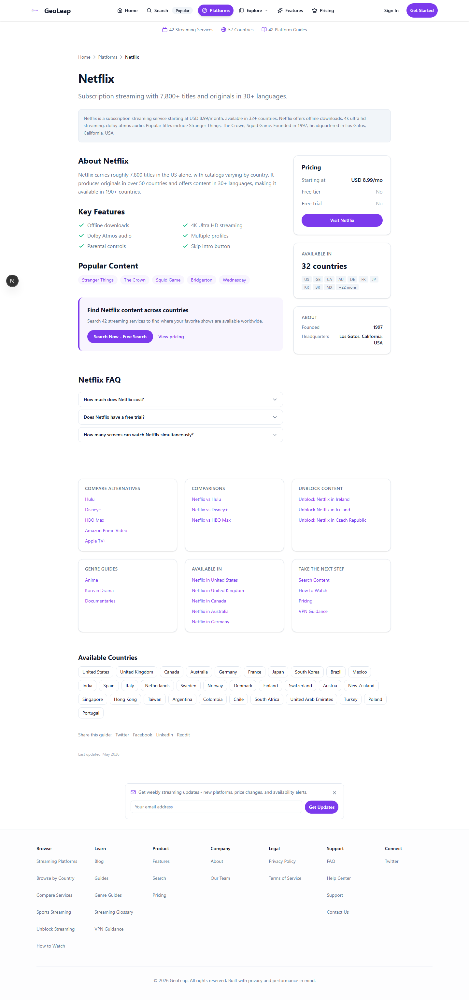
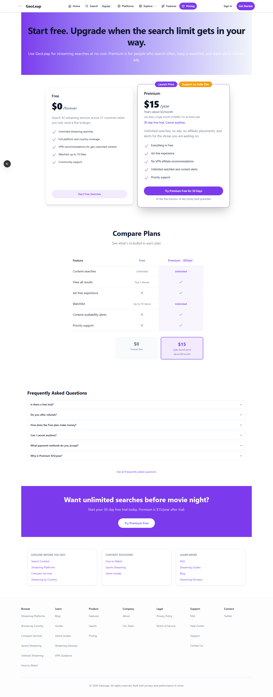
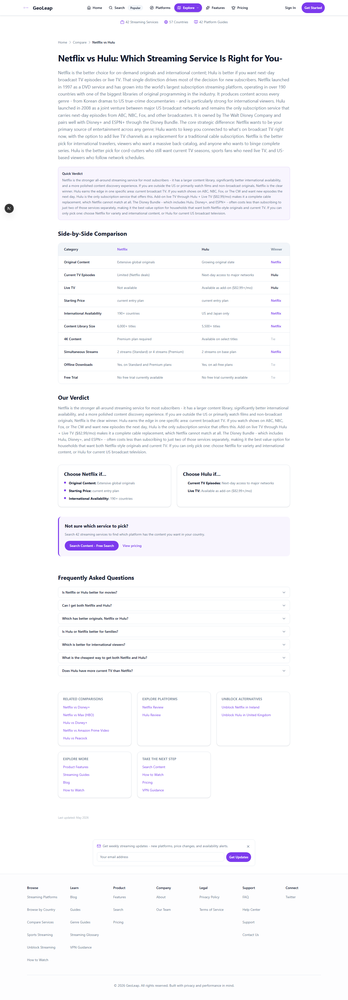
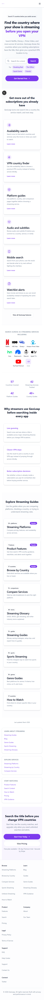
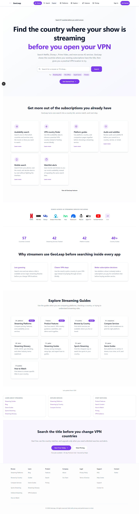

# GeoLeap

Find out which country a show or movie is streaming in, then learn how to watch it. Pick a
title, and GeoLeap tells you which streaming services carry it and in which countries. If it is
not available where you are, the app explains what your options are.

> [!IMPORTANT]
> **Code snapshot, retired July 2026.** GeoLeap was an eleven-month solo build (August 2025 to
> July 2026), deployed under `geoleap.app` and `api.geoleap.app`. Neither hostname resolves any
> longer. This repository is the code as it stood at the end, squashed into one commit. The
> screenshots below were captured from the app running on my machine, against a seeded database
> with one test user and ten titles, not from a live service.

> [!NOTE]
> Built by [Angel Campa](https://github.com/AngelCampa1). Source-available for portfolio review,
> not open source: see [License](#license).

[](portfolio/METRICS.md)
[](portfolio/METRICS.md)
[](LICENSE)

*No CI badge: there is no GitHub Actions workflow in this repository.
[`.githooks/pre-commit`](.githooks/pre-commit) is what enforced quality locally, see
[Built with AI agents](#built-with-ai-agents).*


*The top of the public home page, captured from the local stack against seeded data, 7 August
2026. The full page, including the feature grid, platform logos, and stat counters, is in
[Screenshots](#screenshots).*

---

## Contents

- [If you read one thing](#if-you-read-one-thing)
- [What it did](#what-it-did)
- [Architecture](#architecture)
- [Engineering worth reading](#engineering-worth-reading)
- [By the numbers](#by-the-numbers)
- [Testing](#testing)
- [Screenshots](#screenshots)
- [Repository map](#repository-map)
- [Documentation](#documentation)
- [Built with AI agents](#built-with-ai-agents)
- [Running it locally](#running-it-locally)
- [Who built this](#who-built-this)
- [License](#license)

---

## If you read one thing

Read [portfolio/COST-CONTROL.md](./portfolio/COST-CONTROL.md). Every answer GeoLeap gives costs
money to fetch from a single paid API, and most of the interesting engineering here is about not
fetching. That page also documents the repository's clearest honesty case: two budget systems
with different numbers, only one of which actually gates the paid call. Five minutes gets you
[Engineering worth reading](#engineering-worth-reading) below; thirty gets you
[portfolio/ARCHITECTURE.md](./portfolio/ARCHITECTURE.md).

---

## What it did

Three clients and one API, built as a single repository. A visitor searched for a title, saw
which countries and services carried it, and, if it was not available locally, got a VPN country
recommendation instead of a dead end. Signed-in users kept a watchlist, set streaming preferences,
and could upgrade to a paid tier. The stack was retired in July 2026.

| Part | Stack | What it is |
|---|---|---|
| `backend/` | .NET 9, PostgreSQL, Redis, SignalR, Hangfire | The API. 68 controllers, 905 HTTP endpoints, 202 EF Core entities. |
| `frontend/` | Next.js 16, React 19, TypeScript, Tailwind v4 | The web app. 79 routes, of which 30 are a programmatic SEO surface. |
| `mobile/` | React Native 0.81, Expo 54 | The phone app. 46 screens, biometric auth, in-app purchases. Never captured, see [Screenshots](#screenshots). |
| `e2e/` | Playwright | 31 end-to-end specs against the running stack. |

**Where the data came from.** GeoLeap had no catalogue of its own and scraped nothing.
Availability came from a commercial per-call API, `streaming-availability.p.rapidapi.com`,
configured at [`appsettings.json:69`](backend/GeoLeap.Api/appsettings.json) and consumed under
its own terms. A TMDB client for titles and artwork was built alongside it and then switched
off: `Program.cs` registers `DisabledTmdbClient` against `ITmdbClient`, so the paid availability
API was the only live content source.

---

## Architecture



Full request paths, the data model, and the deployment topology are in
[portfolio/ARCHITECTURE.md](./portfolio/ARCHITECTURE.md).

---

## Engineering worth reading

Nine things in here I would point at in an interview. Each links to the actual code.

### Thin-content suppression for programmatic pages

[`frontend/src/lib/seo/page-governance.ts`](frontend/src/lib/seo/page-governance.ts)

With no launch budget, organic search was the only acquisition channel available, so the
marketing surface is generated rather than written: 41 platforms times 56 countries times 38
genres. Most pages a generator like that can produce are worthless to a search engine and
actively harmful to the domain hosting them.

So indexing is not a per-page decision made by hand. A governance function takes a route and
returns a verdict: whether to index it, what its canonical URL is, whether it belongs in the
sitemap, what content tier it sits in, and what search intent it serves. Defaults cascade, and
individual entities can override.

The adoption is partial, and that is worth saying: [`app/sitemap.ts`](frontend/src/app/sitemap.ts)
consults `isIndexable()` for the platform, country, comparison and unblock families, but genres,
sports, platform-by-genre, platform-by-country, blog, guides and glossary URLs are still emitted
unconditionally. The mechanism is real and the rollout is half-finished.

### A cache with three levels and its own metrics

[`backend/GeoLeap.Api/Services/MultiLevelCacheService.cs`](backend/GeoLeap.Api/Services/MultiLevelCacheService.cs)

L1 is in-process memory, L2 is Redis, L3 is persistence. Six services support it: key
namespacing, TTL policy, warming, invalidation, persistence, and a metrics collector that is
injected rather than bolted on. 14 files go through `ICacheService` today.

### Metering what third-party APIs cost

[`backend/GeoLeap.Api/Services/ApiCostManager.cs`](backend/GeoLeap.Api/Services/ApiCostManager.cs),
[`BudgetManager.cs`](backend/GeoLeap.Api/Services/BudgetManager.cs),
[`CostOptimizationEngine.cs`](backend/GeoLeap.Api/Services/CostOptimizationEngine.cs)

Streaming-availability data is billed per call. Every outbound request goes through
`StreamingAvailabilityClient`, which reads the cache first and, only on a miss, asks
`ApiCostManager` whether today's and this month's summed spend is still under the configured
limit. Aggressive caching is a cost decision here, not just a latency one.

The cost engine advises, and the budget gate fails open. `CostOptimizationEngine` writes
recommendations for a human to act on, its estimates are openly hard-coded assumptions, and
`EnableAutomaticOptimization` is `false`. Both budget checks catch their own exceptions and
return `true`, under the comment `// In case of error, allow the call but log the issue`.

→ [COST-CONTROL.md](./portfolio/COST-CONTROL.md)

### Refusing to start if the database is wrong

[`backend/GeoLeap.Api/Program.cs`](backend/GeoLeap.Api/Program.cs) (`AssertRequiredProductionIndexesAsync`)

Mobile purchase receipts are deduplicated by three unique indexes on `MobileSubscriptions`. If
those indexes are missing, replay protection silently stops working and the same receipt can be
redeemed twice.

So on boot in Production the app queries `pg_indexes` and refuses to start if they are not
there. A loud failure at deploy time instead of a quiet revenue leak later.

### Search ranking that blends several signals

[`backend/GeoLeap.Api/Services/RankingService.cs`](backend/GeoLeap.Api/Services/RankingService.cs)

Relevance is tiered: an exact title match scores 1.0, prefix 0.9, substring 0.8, then a
Levenshtein similarity fallback at 0.7 of the similarity, and original-title match at 0.6. A
description hit adds 0.1, clamped at 1.0.

Popularity is computed separately from TMDB popularity, IMDb rating, and how often the title has
been searched inside the app.

Those two are inputs, not the whole answer. `CalculateRankingScoreAsync` produces the sort key
from six weighted signals: relevance, popularity, availability, freshness, personalisation, and
click-through rate.

### Connection pooling shaped around serverless billing

[`backend/GeoLeap.Api/Program.cs`](backend/GeoLeap.Api/Program.cs) (Npgsql setup)

`MinPoolSize=0`, `MaxPoolSize=5`, `KeepAlive=0`, `ConnectionIdleLifetime=10`. Those are
deliberately small and deliberately impatient, so a Neon serverless compute can actually suspend
when traffic stops. Keepalive pings would have kept it awake and billing.

### Rate limits that explain themselves

[`backend/GeoLeap.Api/Middleware/RateLimitingMiddleware.cs`](backend/GeoLeap.Api/Middleware/RateLimitingMiddleware.cs)

Login is 10 attempts per 5 minutes, and the code says why: raised from 5 per 3 minutes to
accommodate people sharing an IP behind office, cafe, and university NAT, while still stopping
credential stuffing. Content is 200/min, everything else 1000/min. Every number has a comment
giving the reasoning.

One of those numbers is currently fiction. The table lists search at 100/min, but
`ShouldSkipRateLimit` returns early for `/api/search` before any limit is evaluated, under a
comment reading `// TEMPORARY: Disable rate limiting for search endpoints`. Search is unlimited.
The entry in the table is dead configuration.

### A content security policy written by hand

[`frontend/next.config.ts`](frontend/next.config.ts)

Per-directive, with comments. `frame-ancestors 'none'`, `object-src 'none'`, `form-action
'self'`. `unsafe-eval` is allowed in development only, and `upgrade-insecure-requests` is added
in production only. Alongside it: HSTS with preload, a `Permissions-Policy` that turns off
camera, microphone, geolocation, USB and gyroscope, and scopes `payment` to Stripe.

### A pre-commit hook stricter than most CI

[`.githooks/pre-commit`](.githooks/pre-commit)

It works out which of `backend/`, `frontend/`, `mobile/` your staged changes touch, then runs
only those tracks, in parallel, aggregating exit codes and replaying the logs in a fixed order.
The frontend track lints staged files only and includes a full production build, not just a
typecheck. The mobile track lints the whole project, which is slower and was never narrowed.

There is no GitHub Actions workflow in this repository. This hook is what actually enforced
quality, so it is what I am showing.

---

## By the numbers

Everything here was measured on the code in this repository. The commands that produced each
figure are in [portfolio/METRICS.md](./portfolio/METRICS.md).

### Size

| | Files | Lines |
|---|---:|---:|
| C# | 1,101 | 480,141 |
| TypeScript (`.ts`) | 617 | 239,147 |
| React (`.tsx`) | 877 | 313,799 |
| JavaScript | 76 | 17,569 |
| SQL | 3 | 13,129 |
| **Total source** | **2,674** | **1,063,785** |

Of the C# total, 59,442 lines are EF Core migration scaffolding. Application backend code is
about 220,000 lines, and the backend test project is another 167,690.

These are raw line counts including blanks and comments. `cloc` was not available on the
machine, so no comment-stripped figure is published.

### API surface

| | |
|---|---:|
| Controllers | 68 |
| HTTP endpoints (`[HttpGet]`, `[HttpPost]`, …) | 905 |
| GET / POST / PUT / DELETE / PATCH | 507 / 312 / 41 / 43 / 2 |
| Minimal-API endpoints | 34 |
| EF Core entities (`DbSet<>`) | 202 |
| Database tables created by migrations | 215 |
| Service files (131 named `I*.cs`) | 327 |
| `AddScoped`/`AddSingleton`/`AddTransient` calls in `Program.cs` | 225 |
| Custom middleware | 13 |
| Background services (11 `BackgroundService` + 1 `IHostedService`) | 12 |
| SignalR hubs mapped in `Program.cs` | 4 |

Three migration files produce the 202 entities above: the schema was squashed into a single
`InitialPostgresCreate` baseline when the project moved from SQL Server to PostgreSQL in
February 2026, so this is not the full migration history, just the state it landed in.

### How it was built

The snapshot is one commit. The private repository it came from has 2,322 commits across 140
active days, from 22 August 2025 to 8 July 2026. December 2025 was the heaviest month at 659
commits.

Commit subjects by type: 237 `test:`, 224 `fix:`, 87 `docs:`, 70 `feat:`, 35 `refactor:`, 32
`chore:`. More detail in [portfolio/DEVELOPMENT-HISTORY.md](./portfolio/DEVELOPMENT-HISTORY.md).

---

## Testing

Both suites were run on this snapshot. These are the actual results, not a target. Full method,
what the six backend failures are, and the flaky-test detail are in
[portfolio/TESTING.md](./portfolio/TESTING.md).

| Suite | Framework | Total | Passed / failed / skipped |
|---|---|---:|---:|
| Backend | xUnit | 6,588 | 6,527 / 6 / 55 |
| Frontend | Jest | 7,995 | 7,786 / 0 / 209 |
| Mobile | Jest | 236 files | not run |
| End-to-end | Playwright | 31 specs | not run |

Coverage, measured in the same runs:

| | Lines | Branches |
|---|---:|---:|
| Backend (coverlet) | 26.13% | 27.95% |
| Frontend (Jest) | 54.50% | 49.83% |

The frontend has a 60% coverage gate configured in `jest.config.js`. It does not currently pass.
The backend has no gate configured.

---

## Screenshots

The full archive is in [docs/screenshots/](docs/screenshots/), which records the route, viewport
and capture conditions for every image and names the weak ones. Read that file before drawing
conclusions from any of these: several signed-in pages were captured against a database holding
one seeded user and ten titles, so they are honestly empty rather than broken, and the admin
dashboard's business figures are generated placeholders, not data. `app/dashboard.png` and
`app/watchlist.png` are two of the weak ones the archive names, since the freshly seeded dashboard
reads zero on every counter and the watchlist capture shows a disconnected banner over an empty
list, so neither leads here; the pairing below uses the strongest populated captures instead.
Capturing the signed-in pages at all surfaced a real bug: `frontend/src/middleware.ts` was
reading a session cookie named `accessToken`, but `AuthController` had only ever written
`access_token`, so every authenticated visitor bounced back to the login page. It was caught
because those routes would not screenshot, fixed with a one-line cookie-name correction, and is
recorded in full in [portfolio/ENGINEERING-LOG.md](./portfolio/ENGINEERING-LOG.md).

The signed-in product first:

<table>
<tr>
<td width="50%" valign="top">

<br>
<em>The admin panel. The customer, revenue and subscription figures are hard-coded
in <code>generateMockMetrics()</code>
(<a href="frontend/src/components/admin/UnifiedAdminDashboard.tsx">UnifiedAdminDashboard.tsx</a>),
not read from the database.</em>
</td>
<td width="50%" valign="top">

<br>
<em>The upgrade page: static plan copy, not seeded data, which is why it renders fully on
a fresh account where the dashboard does not.</em>
</td>
</tr>
</table>

Then the public pages:

<table>
<tr>
<td width="50%">

<br>
<em>A generated platform page</em>
</td>
<td width="50%">

<br>
<em>Pricing</em>
</td>
</tr>
<tr>
<td width="50%">

<br>
<em>A generated comparison page</em>
</td>
<td width="50%">

<br>
<em>The web home page at 390px</em>
</td>
</tr>
<tr>
<td colspan="2">

<br>
<em>The full home page. The hero above is the top of this same capture, cropped to the
above-the-fold region; this is the whole thing.</em>
</td>
</tr>
</table>

There are no screenshots of the React Native app anywhere in this repository. The 46 mobile
screens are code only: capturing them needs a simulator or a device, and the Expo build was not
stood up for this snapshot. The 390px image above is the web app at a phone width, not the phone
app.

---

## Repository map

```text
backend/
  GeoLeap.Api/            .NET 9 API
    Controllers/          68 controllers
    Services/             327 services
    Middleware/           13 middleware
    Hubs/                 SignalR
    Data/                 EF Core context, migrations, seeders
    ProgrammaticSeo/      second DbContext, templates, Hangfire jobs
  GeoLeap.Api.Tests/      415 xUnit test files
  GeoLeap.Seeder/         standalone data seeder
frontend/
  src/app/                79 routes; (marketing) holds the pSEO surface
  src/components/         280 components, 33 of them shadcn primitives
  src/lib/seo/            governance, schema markup, feeds, IndexNow
  src/hooks/              33 hooks
mobile/
  src/screens/            46 screens
  src/services/           66 services
e2e/                      31 Playwright specs
portfolio/                The write-ups linked below
docs/
  screenshots/            the archive, route by route
  user-stories/           the original user stories, written before the API existed
  audit/                  dated audit runs from the build
  Research/               domain research
  rbac-system-documentation.md   RBAC reference, still on SQL Server DDL
infrastructure/           Azure Pipelines, Bicep, pSEO infrastructure
```

`portfolio/` is retrospective and finite: seven documents, every figure traceable to a command or
a file. `docs/` is the working residue of eleven months: plans, audits, market research, SEO
notes, a user-story tracker. It is left in because deleting it would tidy away the evidence of
how the thing was actually built, but nothing in there is addressed to a reader.

---

## Documentation

[portfolio/](./portfolio/) is retrospective and finite, written for a reviewer: every claim
traces to a file or a command. [docs/](./docs/) is the eleven months of working residue:
audits, research, user stories, written for the author, not curated for a reader.

Start with [portfolio/README.md](./portfolio/README.md), the index for everything in
`portfolio/`.

---

## Built with AI agents

Most of this was built by AI agents that I directed. The result is visible in the ratio of the
2,322-commit history: 237 `test:` commits against 70 `feat:` commits, more than three to one,
which is a direct product of the process below rather than an accident.

`CLAUDE.md` and `AGENTS.md` are committed on purpose and reviewed like source: they are the
record of the orchestration process itself, not internal notes scrubbed before publishing. What
is in them:

- **Test-first, enforced mechanically.** Not a request in a prompt, a gate in
  [`.githooks/pre-commit`](.githooks/pre-commit) that rejects the commit. It works out which of
  `backend/`, `frontend/`, `mobile/` the staged changes touch, runs only those tracks, and fails
  the commit on any non-zero exit code. Agents route around instructions; they do not route
  around a failing exit code.
- **Worktree isolation.** Parallel agents get their own git worktree, branched from `main`,
  never from another feature branch. `scripts/new-worktree.sh` sets one up with env files copied
  and dependencies installed.
- **Explicit write scopes.** Agents working in parallel are given disjoint file sets. Two agents
  editing the same file is the failure mode that costs the most to untangle.
- **Two-stage review.** Spec compliance first, then code quality, before anything merges.

What the process did not catch: it does not scan for secrets, and credentials were committed to
the source repository more than once across the eleven months, see
[portfolio/DEVELOPMENT-HISTORY.md](./portfolio/DEVELOPMENT-HISTORY.md) for what that cost. And
the stated coverage target in `CLAUDE.md` is 95% per touched file; the measured reality is
26.13% backend and 54.50% frontend. A gate that only checks build, lint, typecheck and test exit
codes cannot enforce a coverage number nobody wired into it.

---

## Running it locally

You need .NET 9, Node 22 or newer, and Docker.

### The web app on its own

The homepage and the whole marketing surface (roughly 250 pages across platforms, countries,
comparisons, genres, sports, guides and the glossary) are server components that read from
TypeScript data files in `frontend/src/data/`. They need no API and no database.

```bash
cd frontend
npm install
npm run dev
```

That serves <http://localhost:3020>.

### The full stack

```bash
docker compose -f docker-compose.dev.yml up -d
```

Postgres comes up on host port 9020 and Redis on 6379. The development settings expect 5432 and
6380, so override them rather than editing the file:

```bash
cd backend/GeoLeap.Api
ASPNETCORE_ENVIRONMENT=Development \
ENABLE_HANGFIRE=true \
ConnectionStrings__DefaultConnection='Host=127.0.0.1;Port=9020;Database=GeoLeap_Dev;Username=postgres;Password=GeoLeap123!' \
ConnectionStrings__Redis='127.0.0.1:6379' \
dotnet run
```

The API serves <http://localhost:8020>, with Swagger at `/swagger` and health at `/health/ready`.

`ENABLE_HANGFIRE=true` is not optional, despite the name. Several services take a constructor
dependency on `Hangfire.IBackgroundJobClient`, so leaving Hangfire off fails DI validation and
the process dies at startup.

The connection string above sets `CommandTimeout=30`, and the migration path calls
`SetCommandTimeout(GetMigrationTimeout())`, which is 10 minutes in Production but falls back to
that 30-second default otherwise, so `InitialPostgresCreate` needs `DB_MIGRATION_TIMEOUT_SECONDS`
set on a cold Development database. Applying the migration out of band and booting with
`SKIP_DB_MIGRATIONS=true` also works, which is how the screenshots here were taken.

In Development the app seeds a test user (`test@example.com` / `Test123!`) and ten sample
titles.

### Re-taking the screenshots

With both servers up:

```bash
npx playwright install chromium   # once
node scripts/capture-screenshots.mjs
```

---

## Who built this

[Angel Campa](https://github.com/AngelCampa1), solo, over eleven months, directing AI agents
under the process in [CLAUDE.md](CLAUDE.md) and [AGENTS.md](AGENTS.md). See
[portfolio/DEVELOPMENT-HISTORY.md](./portfolio/DEVELOPMENT-HISTORY.md) for how that time broke
down.

---

## License

Copyright (c) 2025-2026 Angel Campa. Source-available for portfolio review, not open source: no
license to use, copy, modify or redistribute is granted. Full terms in [LICENSE](LICENSE).
