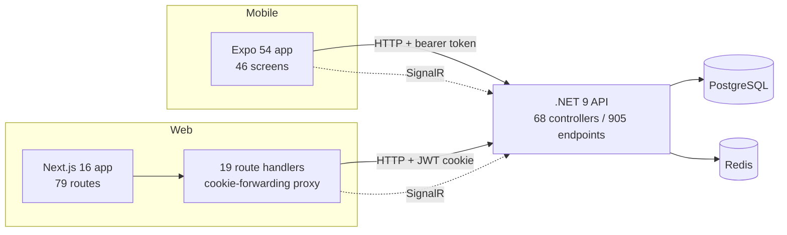
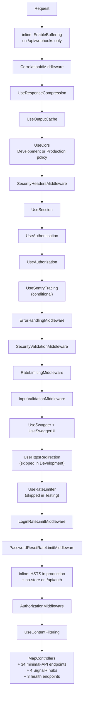
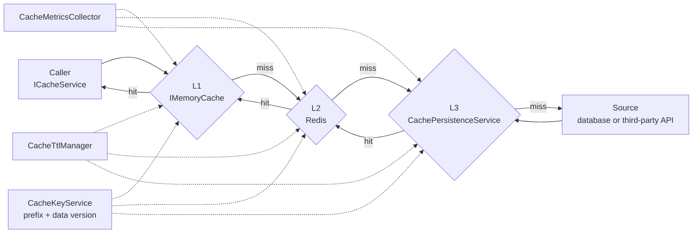
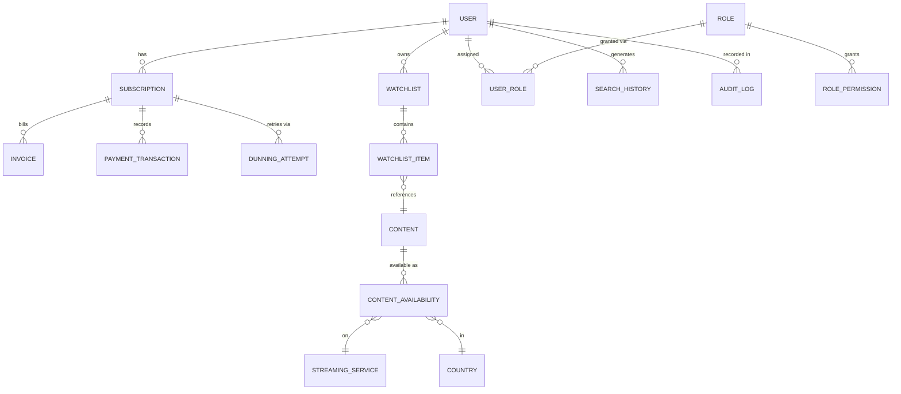
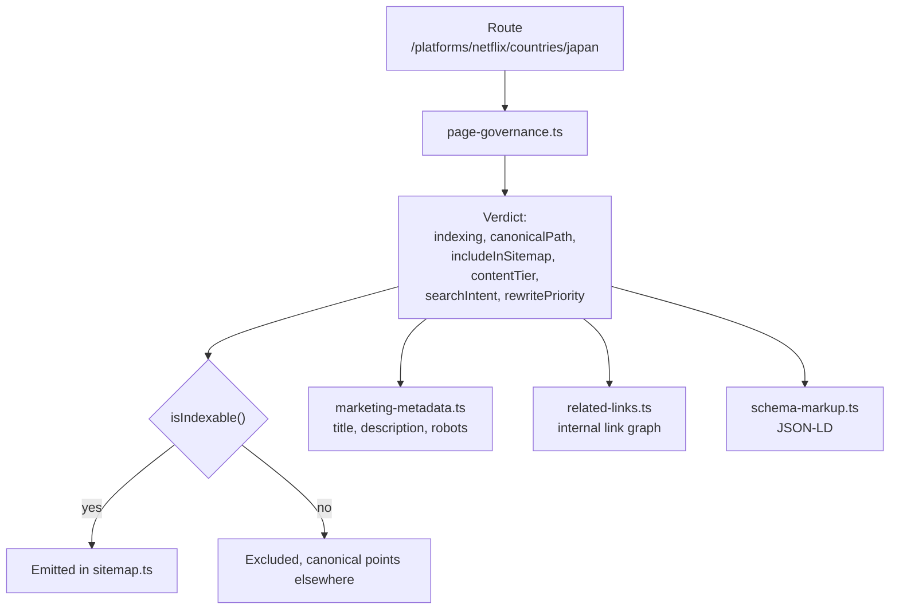
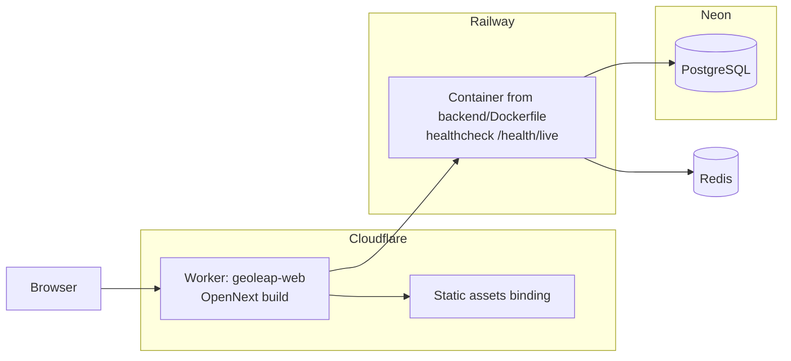
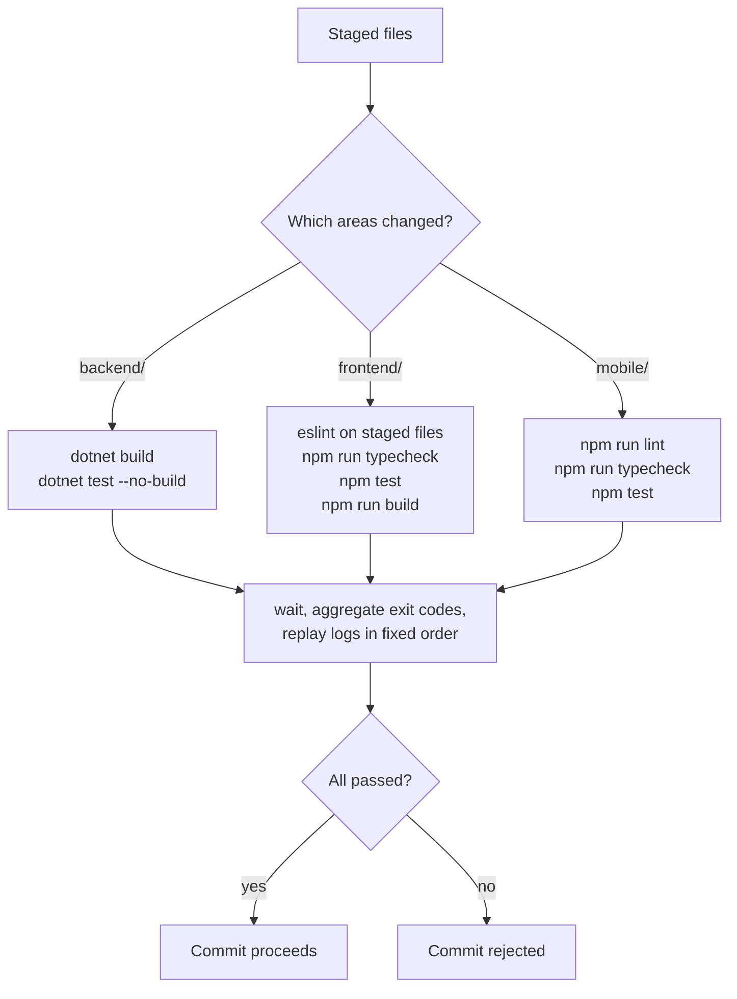

# Architecture

How GeoLeap is put together, and why in a few places where the reason is not obvious
from the code.

---

## System shape

One API serves two clients. There is no shared package between web and mobile; they
share a taxonomy and a design-token vocabulary, but the types are declared twice.
That was a deliberate trade at the time (no monorepo tooling, two very different
build pipelines) and it is a real cost: `frontend/src/types/` and `mobile/src/types/`
drift.



### Why the web app proxies through its own route handlers

Next.js `rewrites()` in `next.config.ts` forward most `/api/*` traffic straight to
the API. But rewrites do not forward `Set-Cookie` back to the browser, and this app
puts its session in an HTTP-only cookie. So every route that participates in auth
(`auth`, `payment`, `dashboard`, `user`, `watchlist`, `preferences`, `notifications`,
`friends`, `subscription`) gets a real route handler under
`frontend/src/app/api/` that proxies the request and passes the cookie through.

That is the whole reason there are 19 route handlers under `app/api/` in a project
that otherwise talks to the API directly. Six more `route.ts` files sit elsewhere
under `app/` and generate output rather than proxying anything: `feed.xml`,
`feed.json`, `image-sitemap.xml`, `news-sitemap.xml`, `ads.txt` and
`.well-known/ai.txt`. That makes 25 `route.ts` files in total, which is the number
the metrics table reports.

---

## Request path

Middleware order in `backend/GeoLeap.Api/Program.cs`, top to bottom as registered:



Two of these are inline lambdas rather than named middleware classes, and both are
there for a specific reason.

The first one runs before everything else, including correlation-id assignment. It
calls `EnableBuffering()` on requests to `/api/webhooks` so the body can be read more
than once. Stripe verifies its webhook signature against the raw, unmodified bytes,
and model binding would otherwise consume the stream before the handler could check
it. Anything registered ahead of this that touched the body would break signature
verification, which is why it sits at position zero.

The second, near the end, adds `Strict-Transport-Security` in production and forces
`no-store` on `/api/auth` responses so credentials never land in a shared cache.

`CorrelationIdMiddleware` runs immediately after, so every log line downstream,
including anything the error handler emits, carries the same correlation id.

There are two rate-limiting layers, which is not an accident but is worth
questioning: `RateLimitingMiddleware` is a custom per-endpoint limiter with
documented per-route budgets, while `UseRateLimiter` is the framework limiter
configured with six partitioned policies (four fixed-window, two sliding-window).
The two dedicated limiters after it, for login and password reset, exist because
those two flows needed different budgets and different lockout behaviour than
anything the general limiter expressed well.

---

## Caching

Three levels behind one interface.



`MultiLevelCacheService` is the implementation. Metrics and TTL policy are
constructor dependencies rather than static calls, so both are substitutable in
tests. `CacheKeyService` namespaces every key with a prefix and a data version,
which makes a global invalidation a config change rather than a `FLUSHALL`.

`CacheWarmingService` is one of the twelve hosted services and pre-populates the
paths that would otherwise cold-start on the first request after a deploy.

Above all of it, the edge caches too: `next.config.ts` sets
`s-maxage=86400, stale-while-revalidate=43200` on the programmatic SEO routes and
`max-age=31536000, immutable` on hashed static assets, and `open-next.config.ts`
turns on Cloudflare cache interception.

There is a cost reason for this, not only a latency one. See below.

---

## Third-party API cost control

Streaming availability data is billed per call. `StreamingAvailabilityClient` is the
only class that issues the request, and it reads the cache before doing anything else.
On a miss it calls `IApiUsageTracker.CanMakeApiCallAsync()`, which delegates to
`ApiCostManager`, which sums today's and this month's `EstimatedCost` from
`ApiUsageRecords` and compares them against `StreamingApi.DailyBudgetLimit` ($10) and
`MonthlyBudgetLimit` ($200). Over the limit, the client throws rather than degrading.

There is a second budget system (`BudgetManager` and `ApiCostTracker`, reading
`CostManagementSettings.BudgetConfiguration`: $20/day, $500/month, $300 reserved for
`streaming-availability`), which is per-provider and cost-aware and therefore better,
but is only reached from `CostManagementController`. It reports; it does not gate.
`CostOptimizationEngine` is likewise advisory: it writes recommendations for a human,
and `EnableAutomaticOptimization` is `false`.

`CircuitBreakerService` and `DatabaseResilienceService` sit alongside, configured
per provider: failure threshold 5, recovery timeout 60s, 3 retries. The 4-requests-
per-second ceiling in the TMDB block is dead configuration: `Program.cs` registers
`DisabledTmdbClient` against `ITmdbClient`, so no TMDB request is ever made.

The practical consequence is that a cache miss is not just slower, it costs money,
which is why the cache has three levels and a warming service.

Full walkthrough of the paid path, including where the gate fails open:
[COST-CONTROL.md](COST-CONTROL.md).

---

## Data

202 `DbSet<>` properties on `ApplicationDbContext`, producing 215 tables. A second
context, `SeoDbContext`, backs the programmatic SEO subsystem.

The domain clusters into roughly:



Around that core sit the analytics, social sharing, notification, ASO, affiliate and
experiment groups, which is where most of the 215 tables live.

### Migrations

Three, not because the schema changed three times but because it was squashed into
`InitialPostgresCreate` when the project moved off SQL Server in February 2026. The
two that follow it are genuine increments: an affiliate partner system, and unique
indexes for mobile subscription replay protection.

`PerformanceIndexConfiguration.cs` holds index tuning separately from the entity
configurations.

### Refusing to start on a wrong schema

`AssertRequiredProductionIndexesAsync` in `Program.cs` queries `pg_indexes` at boot
and, in Production only, throws if the three unique indexes on `MobileSubscriptions`
are missing. Those indexes are what stop the same App Store or Play receipt being
redeemed twice. Without them nothing errors, purchases just silently double-count,
which is the kind of failure you find in a reconciliation three weeks later.

### Connection pooling

```text
MinPoolSize=0  MaxPoolSize=5  KeepAlive=0  ConnectionIdleLifetime=10  Timeout=20
```

Sized for Neon serverless. A conventional pool holds connections open and pings them
to keep them warm, which would prevent the compute from ever suspending. Here the
pool is allowed to drain to zero and nothing pings, so an idle deployment costs
nothing.

The same settings are why the baseline migration cannot be applied by the app on a
cold database: `CommandTimeout` is fixed at 30 seconds, and `InitialPostgresCreate`
takes longer than that. Setting `DB_MIGRATION_TIMEOUT_SECONDS`, or applying the
migration out of band and booting with `SKIP_DB_MIGRATIONS=true`, works around it;
see [Running it locally](../README.md#running-it-locally) in the README.

---

## Programmatic SEO

The largest single subsystem, and the most interesting one.

The marketing surface is combinatorial: 41 platforms, 56 countries, 38 genres, 47
sports, 105 glossary terms, 58 comparisons. Cross-producing those gives tens of
thousands of possible URLs. Most of them would be thin pages, and publishing thin
pages at scale damages a domain rather than helping it.



The governance function is the single decision point. Defaults cascade by route
family and individual entities override. The rollout is partial. `app/sitemap.ts`
calls `isIndexable()` at four places only, for the platform, country, comparison
and unblock families. Genre, sport, platform-by-genre, platform-by-country, blog,
guide and glossary URLs are still emitted unconditionally, so for those families
the sitemap and the canonical tags can still disagree.

Supporting pieces: `schema-markup.ts` for JSON-LD (StreamingService, Product,
HowTo, FAQ, Speakable), `related-links.ts` for the internal link graph,
`indexnow.ts` plus `app/api/indexnow/route.ts` to push changes, and six metadata
routes including a news sitemap and an image sitemap.

On the backend, `ProgrammaticSeo/` has its own DbContext, template services,
keyword research services, and a `ContentQualityValidatorService`. Its recurring
jobs run on Hangfire, which is disabled in Development.

---

## Real time

Six classes derive from `Hub`. Four are mapped and reachable: `/admin-hub`,
`/watchlist-hub`, `/user-behavior-hub`, `/monitoring-hub`. The other two are not.
`PreferencesHub` ships a `MapPreferencesHub()` extension method that nothing calls.
`SocialActivityHub` is declared inside `Services/SocialActivityService.cs` and gets
injected as an `IHubContext`, so the server can push to it, but it was never given a
route, so no client can subscribe. Both are dead ends.

Both clients connect with `@microsoft/signalr`; the web client wrapper is
`frontend/src/services/signalRClient.ts`.

---

## Background work

Twelve `BackgroundService` implementations run in-process: cache warming, dunning,
notification digests, provider registration, quality monitoring, refresh processing,
subscription monitoring, token cleanup, user behaviour, watchlist processing.

Hangfire handles recurring scheduled work, with its dashboard at `/admin/jobs`
behind `HangfireDashboardAuthorizationFilter`. It is gated on `ENABLE_HANGFIRE`,
which is off by default in Development. That gating is buggy: several services take
a hard constructor dependency on `IBackgroundJobClient`, so leaving it off fails DI
validation at startup.

---

## Deployment



`wrangler.jsonc` sets `run_worker_first` for `/dashboard*`, `/settings*`,
`/support*` and `/upgrade*`, so the middleware that checks the session runs before
the asset handler can serve a cached shell to a signed-out visitor. `workers_dev`
and preview URLs are both disabled.

The backend ran on Railway from `backend/Dockerfile`, a three-stage build with
`UseAppHost=false`, restarting on failure up to three times, health-checked at
`/health/live`.

Azure Pipelines definitions remain in `infrastructure/azure-pipelines/` from an
earlier hosting arrangement. They were not the path this deployed through.

None of this is running now: the diagram above records the topology the config in this
repository describes, not a live system.

---

## Quality gate

There is no GitHub Actions workflow. `.githooks/pre-commit` is what enforced quality:



The tracks run as parallel background jobs. Lint is scoped to staged files only.
The frontend track includes a full production build, which most CI setups skip on
every commit.

It does not scan for secrets, which is how credentials ended up committed to the
source repository more than once.
