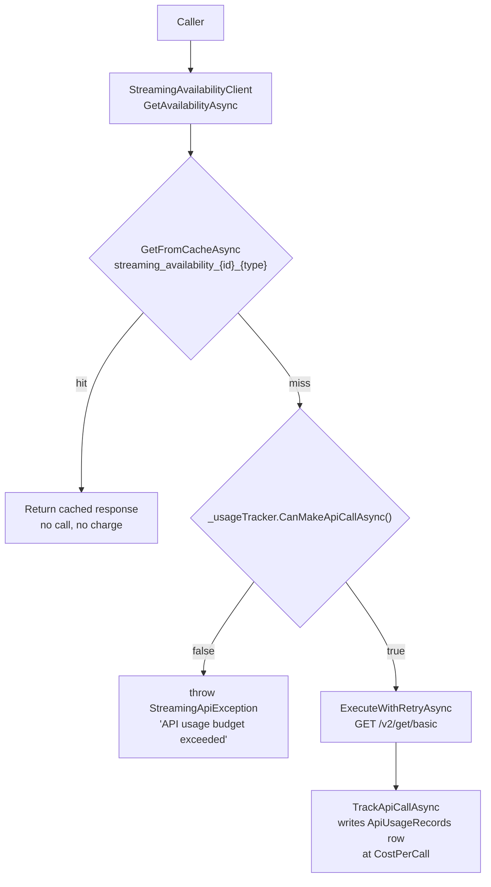

# Cost control

Every availability answer GeoLeap gives costs money to fetch. One commercial API,
billed per call, is the only live source of the product's core fact. So the shape of
this codebase is mostly a set of answers to one question: how do you avoid making the
call?

This page walks the paid call path from the caller down to the HTTP request, names the
code at each step, and states plainly where the mechanism does less than it looks like
it does. Two of the four things it looks like are not what they are.

---

## The one paid dependency

`appsettings.json:69` points at `https://streaming-availability.p.rapidapi.com`. That
is the only live third-party content source in this repository.

TMDB is not one. A full TMDB client was built and then switched off: the key at
`appsettings.json:85` is the literal string `DISABLED`, the section carries a
`_comment` saying so at line 82, and `Program.cs:726` registers

```csharp
builder.Services.AddScoped<ITmdbClient, DisabledTmdbClient>();
```

`DisabledTmdbClient` (`Services/DisabledTmdbClient.cs`) implements the full interface
and returns empty results from every method, logging at debug level. Nothing calls
TMDB at runtime. Configuration for it survives (a base URL, a 4-requests-per-second
ceiling, a `tmdb: 100.00` line in the provider budget table), and all of it is dead.
That configuration is why a reader skimming `appsettings.json` would reasonably
conclude TMDB is live. It is not.

---

## The call path



`Services/StreamingAvailabilityClient.cs` is the only class that issues the HTTP
request. It checks the cache before doing anything else, and consults the budget gate
only on a miss. Three call sites in that file follow this pattern (lines 87, 188 and
556). On refusal it throws rather than returning stale or partial data.

`IApiUsageTracker.CanMakeApiCallAsync()` is a one-line delegation
(`Services/ApiUsageTracker.cs:160-163`) to `ApiCostManager`.

---

## What the enforced budget actually is

This is the part worth reading carefully, because the repository contains **two
independent budget systems with different numbers, and only one of them can stop a
paid call.**

### The one that gates the call

`Services/ApiCostManager.cs` takes `IOptionsMonitor<StreamingApiSettings>` and compares
today's and this month's summed `EstimatedCost` from `ApiUsageRecords` against:

| Setting | `appsettings.json` | Value |
|---|---|---:|
| `StreamingApi.DailyBudgetLimit` | line 77 | **$10.00** |
| `StreamingApi.MonthlyBudgetLimit` | line 78 | **$200.00** |
| `StreamingApi.CostPerCall` | line 79 | $0.001 |

At $0.001 a call, $10 a day is 10,000 calls a day.

Daily totals are cached for one minute and monthly totals for five
(`ApiCostManager.cs:88-92`, `124-128`), so the gate reads a slightly stale number by
design rather than summing the table on every request.

### The one that does not

`CostManagementSettings.BudgetConfiguration` (`appsettings.json:268-280`) declares a
different, larger ceiling:

```json
"BudgetConfiguration": {
  "MonthlyLimit": 500.00,
  "DailyLimit": 20.00,
  "AlertThresholds": [80, 90, 95],
  "ProviderLimits": {
    "streaming-availability": 300.00,
    "tmdb": 100.00,
    ...
  }
}
```

This block is bound at `Program.cs:774-775` and read by `BudgetManager` and
`ApiCostTracker`. `BudgetManager.CanMakeApiCallAsync(providerId, estimatedCost)` is a
better-designed gate than the one that runs: it is per-provider, it takes the cost of
the call it is about to authorise, and it checks the provider sub-limit as well as the
daily and monthly totals.

It has exactly one caller: `Controllers/CostManagementController.cs:292`, an
administrative endpoint. **No code on the availability path calls it.** The
`$300.00` reserved for `streaming-availability` is a number an admin can query. It
does not constrain the client.

So the honest statement of the ceiling is: **$200 a month and $10 a day, enforced;
$500, $20 and a $300 provider reservation, declared and reportable.** The two were
never reconciled. I would rather show that than quote the larger pair as though it
were the limit.

### The gate fails open

Both `CanMakeApiCallAsync` and `IsWithinBudgetAsync` in `ApiCostManager` wrap their
work in `try`/`catch` and return `true` from the catch block, with the comment
`// In case of error, allow the call but log the issue` (`ApiCostManager.cs:60-65`,
`222-226`). If the database or the distributed cache is unavailable, spend is
unmetered until it recovers. For a per-call-billed dependency that is the wrong
default, and it is a deliberate-looking choice rather than an oversight: it is
commented.

---

## The cache, which is the actual cost control

Since the gate only refuses at a ceiling, the thing that keeps spend near zero in
normal operation is the cache. `Services/MultiLevelCacheService.cs` sits behind
`ICacheService` with three levels:

| Level | Backing |
|---|---|
| L1 | `IMemoryCache`, in-process |
| L2 | Redis |
| L3 | `CachePersistenceService` |

Six services support it: `CacheKeyService` (85 lines) namespaces every key with a
prefix and a data version, so a global invalidation is a config change rather than a
`FLUSHALL`; `CacheTtlManager` holds TTL policy; `CacheWarmingService` runs as one of
the twelve hosted services and pre-populates paths that would otherwise cold-start
after a deploy; `CacheInvalidationService`, `CachePersistenceService` and
`CacheMetricsCollector` do what their names say. Metrics and TTL policy are
constructor dependencies rather than static calls, which is what makes them
substitutable in tests.

`StreamingApi.CacheDurationMinutes` is 60 (`appsettings.json:76`).

**The abstraction is not universally adopted.** 14 files go through `ICacheService`;
44 others inject `IMemoryCache` or `IDistributedCache` directly and bypass the
multi-level service entirely. It was introduced partway through and never finished
absorbing its callers.

Above the application, the edge caches too. `frontend/next.config.ts` sets
`s-maxage=86400, stale-while-revalidate=43200` on the programmatic SEO routes and
`max-age=31536000, immutable` on hashed assets, and `open-next.config.ts` enables
Cloudflare cache interception.

---

## The marketing surface makes no calls at all

Roughly 250 marketing pages (platforms, countries, comparisons, genres, sports,
guides, the glossary) are server components reading TypeScript data files under
`frontend/src/data/`. They touch neither the availability API nor the database. That
is the largest single reason the paid dependency is rarely hit: the pages a search
engine crawls, and most pages a visitor lands on, cost nothing to serve.

`npm run dev` in `frontend/` alone serves the whole surface with no backend running,
which is the cheapest way to verify this claim.

---

## The optimisation engine advises, it does not decide

`Services/CostOptimizationEngine.cs` (409 lines) analyses cache hit ratios, provider
cost efficiency, hourly usage patterns, and duplicate calls inside ten-minute windows,
and produces `CostOptimizationRecommendation` rows. It flags a hit ratio under 75%,
peak hours accounting for more than 40% of spend, and more than five identical calls
in a window.

Its public surface is `GenerateRecommendationsAsync`,
`AnalyzeOptimizationImpactAsync` and `MarkRecommendationAsImplementedAsync`. Those are
reporting verbs, and its only consumers are `CostManagementController` and a
report-building path in `ApiCostTracker.cs:177-178`. Nothing in the request path
consults it, and `CostManagementSettings.Optimization.EnableAutomaticOptimization` is
`false` in `appsettings.json:287`.

So it is an advisory system that writes recommendations for a human to read. Its
savings figures are also openly estimated rather than measured: "assume 15% savings
through load balancing", "assume 80% could be eliminated", a 60% hit-ratio baseline
when real stats are unavailable, and $50/$200/$500 stand-ins for implementation
effort. Those constants are in the source with those comments. Treat the output as a
prompt to investigate, not as a measurement.

---

## Alerting

`ApiCostManager.CheckBudgetThresholdsAsync` fires a notification at 90% of the daily
limit, and at 50%, 80% and 90% of the monthly limit, with a cache key per threshold
per period so each alert is sent once. `BudgetManager` uses the
`[80, 90, 95]` thresholds from the configuration block instead, a third place where
the two systems disagree about the same concept.

---

## Summary

| Claim | Status |
|---|---|
| One paid content dependency, billed per call | True. `appsettings.json:69` |
| TMDB is a live source | **False.** Disabled client, `Program.cs:726` |
| Cache checked before every paid call | True. `StreamingAvailabilityClient.cs:78-90` |
| Three-level cache behind one interface | True, and bypassed by 44 files |
| ~250 marketing pages make no API or DB calls | True |
| Spend capped at $500/month, $20/day | **Declared, not enforced.** The enforced pair is $200 and $10 |
| $300 reserved for the availability provider | **Reportable only.** No caller on the paid path |
| An engine decides when a cached answer is good enough | **False.** It writes recommendations; auto-optimisation is off |
| Budget gate is fail-closed | **False.** It returns `true` on exception, by design |
