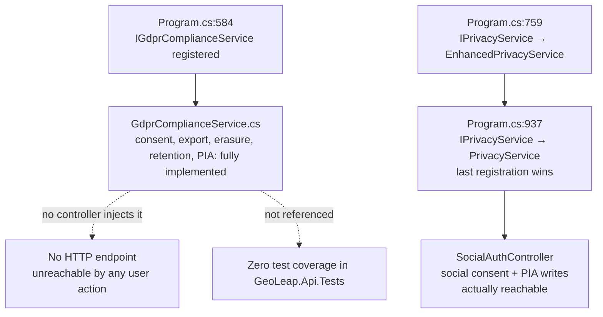

# Security

GeoLeap handles account credentials, Stripe payments, and mobile in-app-purchase receipts,
and it ships a GDPR compliance layer for a product that would have operated in the EU. That
combination is why this document exists: the portfolio standard this repository follows
requires a security or privacy-architecture document for any repo touching payments or a real
privacy surface. Every claim below traces to a file and a line number in this snapshot; where a
mechanism looks stronger than it is, that gap is stated next to the claim rather than left for a
reader to find.

> [!WARNING]
> This is a description of security-relevant code, not a security clearance, see
> [Summary](#summary). Read every claim here as a citation, not an endorsement.

---

## Authentication and sessions

GeoLeap issues short-lived JWTs and serves two client shapes from one API: browsers get an
HTTP-only cookie pair, mobile gets a bearer token in the response body.
`AuthController.LoginAsync` picks between them by checking an `X-Auth-Mode: cookie` header or a
non-mobile `User-Agent` (`AuthController.cs:107-109`). Cookie mode sets:

| Cookie | Flags | Lifetime | Source |
|---|---|---|---|
| `access_token` | `HttpOnly`, `Secure`, `SameSite=None` | 15 minutes | `AuthController.cs:116-123` |
| `refresh_token` | `HttpOnly`, `Secure`, `SameSite=None` | 7 days | `AuthController.cs:125-132` |

`SameSite=None` is deliberate, not lax defaults left in place: the frontend and API were separate
subdomains (`geoleap.app` / `api.geoleap.app`), and the comment at `AuthController.cs:114` says so.
The same pair is re-issued on refresh (`AuthController.cs:210-226`) and cleared with matching
`Delete` calls on logout (`AuthController.cs:259-263`, `UserProfileController.cs:150-151`).

JWT validation (`Program.cs:355-364`) checks issuer, audience, lifetime and signing key, all four
set to `true`, with `ClockSkew = TimeSpan.Zero`: no grace window on expiry. Token extraction
(`Program.cs:377-412`) checks the `Authorization` header first, then the query string for SignalR
hub paths only (a documented fix for WebSocket auth, `Program.cs:377`), then falls back to the
`access_token` cookie for ordinary browser requests. `AuthorizationMiddleware` sits after ASP.NET's
own auth/authz middleware in the pipeline and adds a second, RBAC-specific check
(`AuthorizationMiddleware.cs:41-70`): it resolves the required permission per route, calls
`IRbacService.HasPermissionAsync`, and logs every access attempt (granted or denied) through
`IRbacService.LogAccessAttemptAsync`, including caller IP and user agent.

Mock OAuth is blocked outside Development by an explicit startup check
(`Program.cs:425-432`): if `Authentication:UseMockOAuth` is `true` and the environment is not
Development, the app throws at boot rather than serving fake logins. The `Testing` environment
skips real OAuth wiring entirely (`Program.cs:418`), which is why `appsettings.Testing.json` can
set `UseMockOAuth: true` (line 73) without tripping that guard: it never reaches the code that
checks it.

CORS is two named policies, `Development` and `Production`
(`Extensions/SecurityServiceExtensions.cs:47-133`), both built from `WithOrigins(...)` plus
`AllowCredentials()` rather than `AllowAnyOrigin()`. Mobile app origins are validated with
`SetIsOriginAllowed` instead of a wildcard, with a comment marking it as a deliberate replacement
for a prior `AllowAnyOrigin()` (`SecurityServiceExtensions.cs:74-110`).

---

## Rate limiting

Two independent limiters run in the same pipeline (`ARCHITECTURE.md`'s request-path diagram shows
the order): a custom `RateLimitingMiddleware` with a per-endpoint dictionary defined directly in
code (`RateLimitingMiddleware.cs:22-29`), and the framework's `UseRateLimiter` with six partitioned
policies, which is skipped entirely in the `Testing` environment. Two more dedicated limiters,
`LoginRateLimitMiddleware` and `PasswordResetRateLimitMiddleware`, run after those because login
and password reset needed different lockout behaviour than the general limiter expresses.

**The search skip makes its own configured limit dead.** `_endpointLimits` declares
`/api/search` at 100 requests/minute (`RateLimitingMiddleware.cs:26`), but
`ShouldSkipRateLimit` returns `true` for any path starting with `/api/search`
(`RateLimitingMiddleware.cs:207`), commented `// TEMPORARY: Disable rate limiting for search
endpoints`. Skip evaluation happens first (`RateLimitingMiddleware.cs:46-50`), so
`GetRateLimitForEndpoint` is never consulted for that path: the 100/min entry in the dictionary
is configuration that cannot fire. The same skip list also exempts `/health`, `/api/health`,
`/swagger`, `/api/swagger`, `OPTIONS` preflights, and any path ending in `.js`, `.css`, `.ico`,
`.png`, `.jpg` or `.gif` (`RateLimitingMiddleware.cs:195-216`).

Client identification prefers an authenticated user ID, then falls back to IP
(`RateLimitingMiddleware.cs:124-165`). Forwarded-header spoofing is addressed directly: `X-
Forwarded-For` and `X-Real-IP` are only honoured when the direct connection IP is on a trusted-
proxy allowlist (`127.0.0.1`, `::1` by default), otherwise the raw connection IP is used
regardless of what headers claim (`RateLimitingMiddleware.cs:136-161`). Login and registration
limits were deliberately raised from 5/3 to 10/10 requests per 5 minutes to reduce false
positives for users behind shared IPs (offices, cafes, campus NAT), per the comment at
`RateLimitingMiddleware.cs:20-21`.

---

## GDPR: what is implemented versus what is reachable

Three pieces exist: `Services/GDPR/GdprComplianceService.cs`, `Services/EnhancedPrivacyService.cs`,
and `Models/GDPR/PrivacyImpactAssessment.cs`. Only part of that surface is something a real user
can actually trigger.

**`GdprComplianceService.cs` is complete on paper.** It implements consent recording and
withdrawal (`GdprComplianceService.cs:37-110`), privacy-settings defaults that start every field
`false` (`GdprComplianceService.cs:157-171`), data-subject request creation with a GDPR-mandated
30-day deadline (`GdprComplianceService.cs:242`), a JSON data export covering the user record,
privacy settings, consent history, notification preferences, watchlists and 90 days of
notification logs (`GdprComplianceService.cs:300-357`), erasure that anonymizes the user record
rather than hard-deleting it (`GdprComplianceService.cs:369-423`), a per-data-type retention
policy engine (`GdprComplianceService.cs:18-27`, `450-515`), and a Privacy Impact Assessment
generator (`GdprComplianceService.cs:620-648`).

**None of it has an HTTP endpoint.** `IGdprComplianceService` is registered in DI
(`Program.cs:584`) and appears nowhere else in `backend/GeoLeap.Api` except its own interface and
implementation files: no `GdprController`, no `PrivacyController`, no reference from any other
controller. It also has zero references anywhere in `GeoLeap.Api.Tests`. A user cannot export
their data, request erasure, or withdraw consent through this service today; the mechanism would
need a controller wired to it before it does anything for a real user.

**The mitigation and security-measure lists it would report are hardcoded strings, not
measurements.** `GetMitigationMeasures` and `GetSecurityMeasures`
(`GdprComplianceService.cs:696-755`) return the same fixed list ("Encryption at rest and in
transit", "AES-256 encryption", "TLS 1.3 for transmission", "Regular security audits" and similar)
for every call, with two extra lines appended only when `dataType` is `"biometric"`,
`"genetic"`, `"financial"` or `"health"`. Nothing in these methods checks whether any of those
controls are actually configured. A Privacy Impact Assessment this service produced would be
boilerplate text, not a verified control inventory.

**`EnhancedPrivacyService.cs` is registered, then immediately overridden.** It implements
`IPrivacyService` for social-media consent only: four booleans,
`AllowSocialDataCollection`, `AllowFriendDiscovery`, `AllowSocialRecommendations`,
`AllowActivityTracking` (`EnhancedPrivacyService.cs:21-83`). `Program.cs:759` registers it against
`IPrivacyService`. `Program.cs:937` registers `PrivacyService` against the same interface, directly
under a comment reading `// Removed: Using enhanced version above` (`Program.cs:936`), which has
it backwards: ASP.NET Core's DI container resolves the *last* registration, so `PrivacyService`,
not `EnhancedPrivacyService`, is what every `IPrivacyService` injection actually gets (confirmed:
`SocialAuthController.cs:22,28` injects `IPrivacyService` and resolves to `PrivacyService`).
`EnhancedPrivacyService.cs` has direct unit coverage
(`EnhancedPrivacyServiceDirectTests.cs`, 559 lines) that instantiates the class itself rather than
resolving it through DI: the tests pass, but the class they test is dead code in the running app.

**The one PIA path that is live belongs to `PrivacyService`, not `GdprComplianceService`.**
`PrivacyService.CreatePrivacyImpactAssessmentAsync` (`PrivacyService.cs:1170-1198`) writes to the
same `Models.GDPR.PrivacyImpactAssessment` table via `SocialAuthController`'s consent flow, and
hardcodes `ComplianceStatus = "compliant"` at creation time (`PrivacyService.cs:1184`): asserted,
not verified against anything. Its own retention sweep,
`ProcessAutomatedDataRetentionAsync` (`PrivacyService.cs:1217`), is defined but has no caller
anywhere in the backend: no scheduled job, no controller, nothing invokes it. `PrivacyService`'s
mitigation-measures helper (`PrivacyService.cs:1203-1212`) has the same shape as
`GdprComplianceService`'s: a fixed string per processing type, not a check.

---

## Payments and receipt verification

### Stripe

`StripeWebhookController` is `[AllowAnonymous]` by design ("Webhooks must be publicly accessible.
Signature verification provides security," `StripeWebhookController.cs:12`), and that
verification is real: `EventUtility.ConstructEvent(json, stripeSignature, webhookSecret, tolerance:
300)` (`StripeWebhookController.cs:85`) rejects anything not signed with the configured webhook
secret. The raw request body has to survive intact for that check to work, which is why an inline
`EnableBuffering()` lambda runs before every other middleware, including correlation-ID
assignment, scoped to `/api/webhooks` only (`ARCHITECTURE.md`'s request-path diagram). On
signature failure, the handler logs a truncated SHA-256 hash of the body and a
`SensitiveDataFilter.SanitizeString`-passed 200-character snippet rather than the raw payload
(`StripeWebhookController.cs:89-95`), one of only two call sites for that filter in the whole
backend (see [Log sanitization](#log-sanitization)). The webhook secret's presence and length are
logged for debugging, never its value (`StripeWebhookController.cs:70-73`).

Card numbers never reach GeoLeap's backend. `PaymentService.CreatePaymentIntentAsync` creates a
Stripe `PaymentIntent` with `AutomaticPaymentMethods` (`PaymentService.cs:142`), which is the
pattern where the client collects card details through Stripe's own hosted fields and the backend
only ever sees Stripe's IDs and tokens. `appsettings.json`'s Stripe keys are placeholders reading
`[Retrieved from User Secrets or Azure Key Vault - NEVER commit actual secret]`
(`appsettings.json:360-362`); no live Stripe secret key is committed anywhere in this repository.

### Android in-app purchases

`AndroidReceiptVerificationService.VerifyPurchaseAsync` calls Google's own Android Publisher API
server-to-server (`AndroidReceiptVerificationService.cs:73-74`) rather than trusting anything the
client claims. It checks `PaymentState == 1` (line 87), requires a real expiry timestamp from
Google and explicitly refuses to synthesize one if Google omits it ("Subscriptions must include a
Google-issued future expiry. Never synthesize subscription time when Google omits or returns an
expired expiry," `AndroidReceiptVerificationService.cs:102-113`), and rejects already-expired
subscriptions (lines 116-124). If the Google Play service account isn't configured, verification
fails closed rather than accepting the purchase (`AndroidReceiptVerificationService.cs:62-70`).
Replay protection is enforced at the database level: `AssertRequiredProductionIndexesAsync` in
`Program.cs` checks for three unique indexes on `MobileSubscriptions` at boot and refuses to start
in Production if they're missing, specifically because those indexes are what stop the same App
Store or Play receipt being redeemed twice (see `ARCHITECTURE.md`'s "Refusing to start on a wrong
schema" section).

### iOS in-app purchases

`IosReceiptVerificationService.VerifyReceiptAsync` posts to Apple's production `verifyReceipt`
endpoint first and retries against the sandbox endpoint only on status `21007`
(`IosReceiptVerificationService.cs:40-46`), the same server-to-server pattern as Android. The
shared secret comes from `Apple:SharedSecret` in configuration
(`IosReceiptVerificationService.cs:37`); `appsettings.Testing.json` ships `TeamId: "TEST_TEAM_ID"`,
`KeyId: "TEST_KEY_ID"`, and a `PrivateKey` field whose value is the literal string
`TEST_PRIVATE_KEY_HERE` wrapped in PEM markers (`appsettings.Testing.json:82`), a placeholder
shaped like a key, not a real one. Both receipt services have direct test coverage:
`AndroidReceiptVerificationServiceDirectTests.cs` (739 lines) plus an integration-test twin. The
`BEGIN PRIVATE KEY` block inside that direct-test file is a widely published Google OAuth2 sample
credential used across Google's own client-library documentation and tests, reused here only to
exercise `GoogleCredential.FromJson`'s parsing path, not a credential unique to this project.

---

## Log sanitization

`Infrastructure/SensitiveDataFilter.cs` redacts by field name (password, token, card, SSN and
connection-string variants, roughly 35 names, `SensitiveDataFilter.cs:15-80`) and by value
pattern (JWTs, credit-card-shaped digit runs, SSNs) through `SanitizeString`, `Sanitize`,
`SanitizeJsonString` and `SanitizeExceptionMessage`. `LogSanitizationTests.cs`
(535 lines, `backend/GeoLeap.Api.Tests/Security/`) is real, thorough coverage of it: password
fields, JWTs, credit-card numbers by pattern and by field name, API keys (including a
Stripe-shaped test key, redacted only by field name since the test's own comment notes pattern
detection for `sk_test_` isn't implemented), SSNs, nested dictionaries, and exception messages
containing connection strings.

**The filter is invoked in exactly two places in the running application**, not as a blanket log
protection: `StripeWebhookController`'s signature-failure debug log, and
`Middleware/ImprovedRequestResponseLoggingMiddleware.cs`. The second of those is never registered:
a grep for its class name across `backend/GeoLeap.Api` returns only its own file. The application's
actual request logging is Serilog via `ConfigureRequestLogging`
(`Extensions/LoggingServiceExtensions.cs:77-123`), which logs method, path, status code, elapsed
time and a handful of enrichers (host, scheme, user agent, client IP, user ID). It never logs
request or response bodies, so there is nothing there for the filter to sanitize. An older,
differently named middleware (`RequestResponseLoggingMiddleware`) that would have logged bodies is
explicitly commented out in `Program.cs:1265-1270` with the reason "DISABLED due to response
buffering bug." The filter itself is correct and well-tested in isolation; in production it
protects one deliberate log line, not everything the app writes to a log.

---

## Secrets handling

`appsettings.json`, the file that ships as base/production configuration in this repository, has
no live secrets. `JWT:Secret`, both Stripe keys, the Google OAuth client secret, the Redis
connection string and the streaming-availability API key are all placeholder strings:
`[Retrieved from User Secrets or Azure Key Vault - NEVER commit actual secret]` or the equivalent
Key Vault phrasing (`appsettings.json:16`, `348`, `360-362`, `135`, `70`).

`appsettings.Testing.json` ships fabricated test-only values: a JWT signing secret whose own name
says `for-e2e-testing-only` (line 22), empty streaming/TMDB API keys, a mock Google OAuth client
ID and secret, `TEST_TEAM_ID` / `TEST_KEY_ID` / the literal `TEST_PRIVATE_KEY_HERE` string for
Apple Sign-In (line 82, see [iOS in-app purchases](#ios-in-app-purchases)), and a local-only SQL
Server password (`GeoLeap123!`, line 17) for a Dockerized test database that only exists on a
developer's machine. It also disables IP rate limiting outright
(`EnableEndpointRateLimiting: false`, line 59) and sets `UseMockOAuth: true` (line 73), both
correct for a test environment and inert there, since `Program.cs:418` skips real OAuth wiring
entirely when `EnvironmentName == "Testing"`, which is also why line 73 never reaches the
production guard at `Program.cs:425-432`.

`.env.example` and `mobile/.env.example` ship only placeholder values (`JWT_SECRET=your-super-
secret-jwt-key-minimum-64-characters-for-production-use`, `GOOGLE_CLIENT_ID=your-google-client-
id...`) behind a header comment reading "NEVER commit .env to version control!" No `.env` file is
committed anywhere in this repository, confirmed by direct search.

No secret-scanning tool runs anywhere in this pipeline. `ARCHITECTURE.md`'s own Quality Gate
section says this plainly: `.githooks/pre-commit` is what enforced quality, and "it does not scan
for secrets, which is how credentials ended up committed to the source repository more than once."
That is the strongest first-person admission already in this repo about secrets, and it is quoted
rather than repeated with different framing.

Two things that look like leaked secrets on a first pass are not: `pk_live_` and `phc_`-prefixed
strings that appear in the frontend are Stripe's publishable key and PostHog's project key,
and both vendors document that these specific prefixes are meant to ship in client-side code. The
`BEGIN PRIVATE KEY` block in `AndroidReceiptVerificationServiceDirectTests.cs` is the same publicly
published Google OAuth2 sample credential referenced above, not a credential unique to this
project. Both were confirmed by inspection before being excluded from this document.

---

## Summary

`docs/audit/FINAL-AUDIT-REPORT.md` documents a 20-day internal, AI-assisted bug and quality audit
across the whole app, real work that fixed P0-severity findings. There is no GitHub Actions
workflow in this repository (see the README's badge caveat and `ARCHITECTURE.md`'s Quality Gate
section), so every claim in this document was verified by running tests locally, once, while
preparing this snapshot. The rate-limiter's `/api/search` skip, marked `TEMPORARY` in the code
comment that introduced it, was not threat-modeled.

| Claim | Status |
|---|---|
| Session cookies are `HttpOnly`, `Secure`, `SameSite=None` | True. `AuthController.cs:116-123` |
| JWT validation checks issuer, audience, lifetime and signature | True. `Program.cs:355-364` |
| Mock OAuth is blocked outside Development | True. `Program.cs:425-432` |
| `/api/search` is rate-limited at 100 requests/minute | **False.** Skipped before the limit is ever checked. `RateLimitingMiddleware.cs:207` |
| Stripe webhook signatures are verified before processing | True. `StripeWebhookController.cs:85` |
| Card numbers are handled by GeoLeap's backend | **False.** Stripe `PaymentIntent` + hosted fields; only IDs are stored |
| Android and iOS receipts are verified server-to-server | True. Both call Google/Apple directly, not the client |
| Replay of the same mobile receipt is blocked | True, in Production. `AssertRequiredProductionIndexesAsync` |
| GDPR data-subject rights are reachable through the API | **False.** `GdprComplianceService.cs` has zero controller callers and zero test coverage |
| The GDPR PIA generator measures actual controls | **False.** Hardcoded string lists. `GdprComplianceService.cs:696-755` |
| Log sanitization runs on all request/response logging | **False.** Wired to one debug log line; the middleware that would apply it broadly is never registered |
| Live secrets are committed in this repository | **False**, by inspection, see [Secrets handling](#secrets-handling) |
